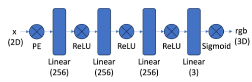
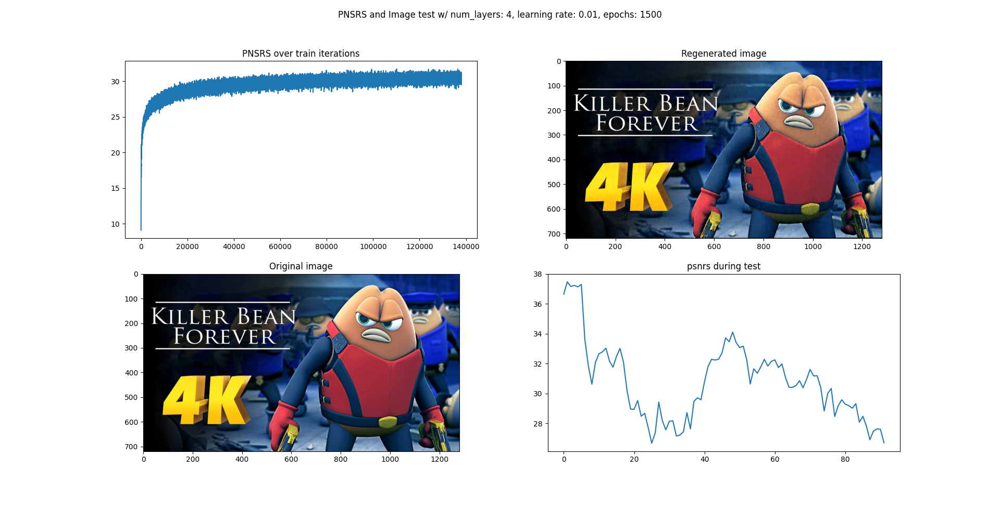
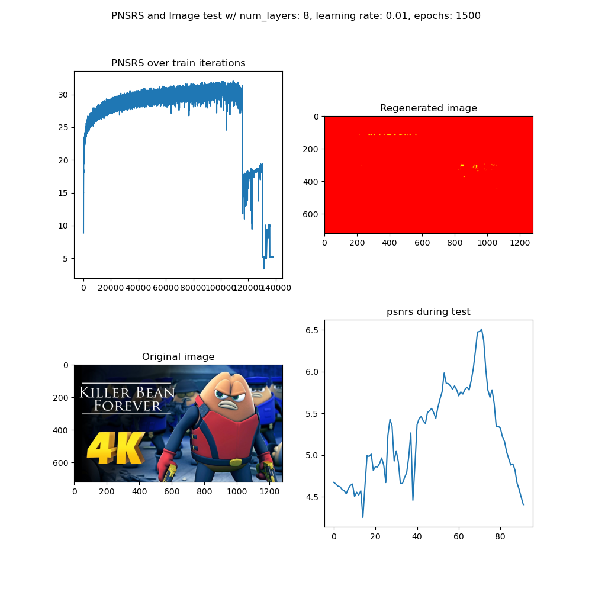
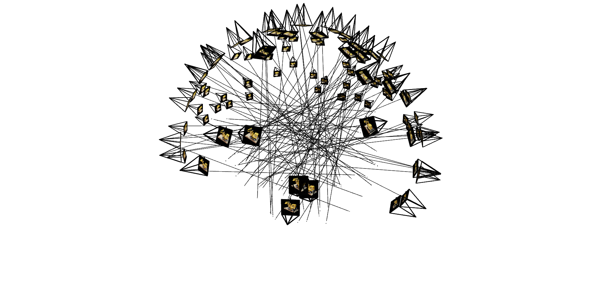
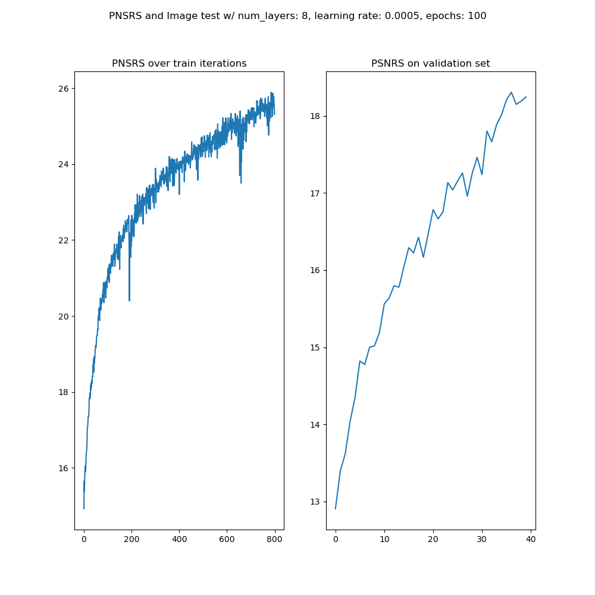
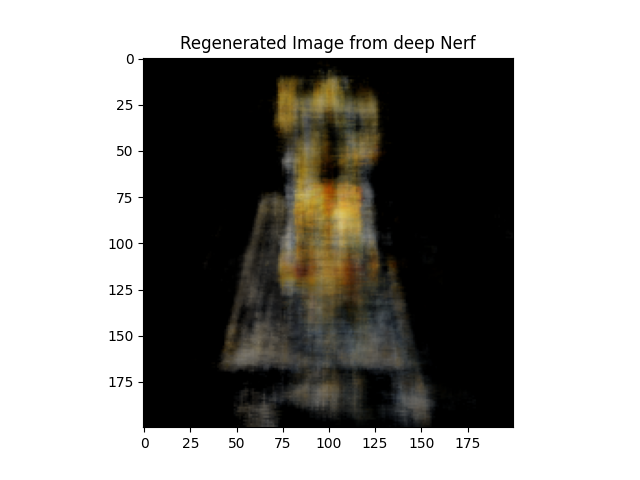

# CS 180 Project 5: Multi-layer Perceptrons and Neural Radiance Fields

## By Kevin Chow

<aside>
📧 contact: chowmein113@berkeley.edu

</aside>

# Abstract

<aside>
💡 The purpose of this project was to implement a multi-layer perceptron and Neural Radiance Field Network for 2D and 3D viewing respectively

</aside>

# Multi-Layer Perceptron

This model can take any given 2D pixel coordinate and output an RGB value based with training on a given image. I designed a multilayer perceptron (MLP) network with sinusoidal positional encoding and trained the network to learn a 2D image and recreate it based on 2D pixel coordinates fed into the image. It uses a series of linear layers , as well as ReLU’s to avoid negative values as RGB values cannot be negative. I finally used a Sigmoid layer as a prediction for 0, 1 for choosing RGB values. 

## Dataset

I used a dataset that can vectorize and output a batch size of 10000 pixel, RGB pair values to train the network by using NumPy and PyTorch Tensors

## Hyper Parameters

### L

the sinusoidal frequency to increase the X (2D) coordinate by, effectively increases the dimension by 2* (2 * L + 1)

### Layers

The amount of linear to ReLU hidden layers in the model

### Learning_step

How big of a step to take when using the gradient calculated by back propagation and MSELoss

Used torch.optimizer.Adam

### Epochs

The amount of training loops to run on batched dataset

## Loss Measuring

I used Mean Squared Error Loss (MSELoss) to measure error between the predicted and goal values while training.

# Multi-Layer Perceptron Results

# Conclusion

Adding more layers made the training time drastically slower than the normal 4 layers initially used. It also barely performed better than the 4 layer MLP model and had gained Loss near the end of training. It seemed the best MLP results came from using a smaller learning step size and higher epoch count with L = 10.

# Part 2: Deep Neural Radiance Field Network (NERF)

I implemented a Deep Learning Neural Radiance Field Model to further expand the use of a MLP model for 3D feature prediction for Multi-view Imaging. It takes a given world coordinate $x_w$, as well as the direction of sight ($r_d$) and predicts the color density based on volumetric rendering by predicting a given density and color value and calculating the equation:

This allows the NeRF model to generate a 3D like model that can view the object from any given angle given a static set of radial images. 

## Training Overview

I took a set of images as well as their camera-to-world homogenous geometric transformation matrices to generate vector ray origin and directions. I then generate sample points along this ray to make word coordinate points with perturbation to feed into the NeRF model

### 

## Creating Rays from Cameras

I used the camera-to-world matrix for each camera, and generated a ray origin $r_o$ and ray direction $r_d$ for every pixel coordinate in the camera frame. this works by using these equations:

For any arbitrary pixel [u, v] I can use the inverse of the intrinsic matrix K to find the 3D camera coordinates and then use the camera-to-world homogenous transformation matrix and find the world coordinate. $r_o$ is found using the translation vector in the camera-to-world matrix. I can then use $x_w,\,\,r_o$to find the unit direction vector, $r_d$

## Sampling Points along Rays

After finding our ray pairs, $r_o,\,\,r_d\,\,$, we can calculate a sample of $n$ sample points using the equation

$$
x_w=r_o+r_d*t
$$

for any value t in a set viewing depth/range. These sample points can then be used to calculate color density of given pixels in a given image frame

## Ray and Sample Point Generation Results

This image shows all the training images as well as random rays and sample points from each image for the multi-view nerf model

This image shows all rays and points in a single image in the Radiance Field

# NeRF Results

The model gained an average around 12 Peak-Sound-to-Noise Ratio amongst 4000 gradient steps in total with 64 sample based volume rendering. The second graph demonstrates the data when changed to a 32 based sample volume rendering. The last graph shows the final Deep NeRF model and its PSNR rating for both training and test validation.

 

## Reconstructed Images

This is the neural radiance field with novel rendering on the first 64 based sample iteration with ~12 PSNR rating

This is the neural radiance field with novel rendering with the final 32 sample based Deep NeRF model with ~ 28 PSNR rating in training

# Conclusion

Overall, his document discusses the implementation and results of two projects: a multi-layer perceptron (MLP) and a deep neural radiance field network (NeRF). The MLP is designed to learn a 2D image and recreate it based on pixel coordinates, while the NeRF model generates a 3D-like model for multi-view imaging. The document includes details on the datasets, hyperparameters, training processes, and results for both projects.

# Problems

During the implementation, I encountered data loading bottlenecks with un-vectorized code as well as taking the time to understand the right input shapes to feed into the NeRF Model. Training was also tricky as computation time was long and data set initialization was drastically expensive as it uses un-vectorized data loading/creation processes